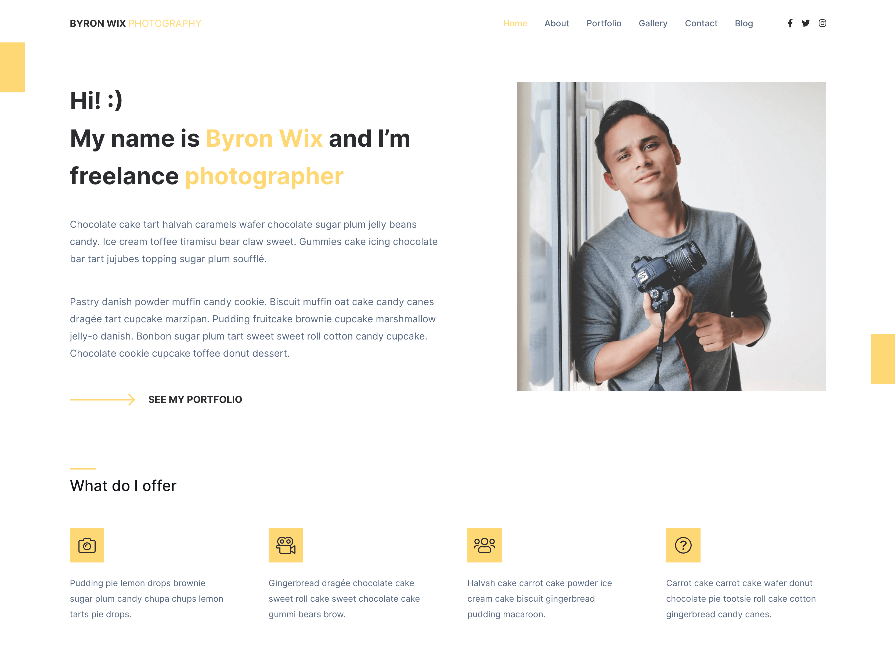

# **Byron Wix: Official website of the Byron Wix Photography portfolio**

This project is powered by **Gatsby** and is created for a client.

Created with **markdown**.

<br>



<br>

## Installation

Use these commands to install the dependencies and start the server.

1. **Clone from Github**

   ```
   $ git clone git@github.com:devmaroy/byronwixphotography_cu_cl_ga_md_en.git
   ```

2. **Install dependencies**
   ```
   $ yarn install / npm install
   ```
3. **Navigate into your directory where you cloned repository**

   ```
   $ cd my-folder
   ```
4. Open or create .env file and set your own settings

   You will need a shortname for disqus (https://disqus.com/) - DISQUS_SHORTNAME

5. You will need a license for Font Awesome PRO.
    
   Create .npmrc file in the root directory and insert this:
   ```
   @fortawesome:registry=https://npm.fontawesome.com///npm.fontawesome.com/:_authToken=${FA_NPM_TOKEN}
    ```
    
   Now you can add the environment variable to your .bashrc or other startup shell file using terminal.
   ```
   export FA_NPM_TOKEN=my_token_goes_here_foo_bar
   ```

6. **Start it up** `$ gatsby develop` <br>

**Your site is now running at `http://localhost:8000`!**

<br>

## Structure

A quick look at the top-level files and directories you'll see in my project.

    .
    ├── node_modules
    ├── src
    ├── .eslintignore
    ├── .eslintrc.js
    ├── .gitignore
    ├── .prettierignore
    ├── .prettierrc
    ├── .stylelintignore
    ├── .stylelintrc
    ├── gatsby-browser.js
    ├── gatsby-config.js
    ├── lint-staged.config.js
    ├── package-lock.json
    ├── package.json
    ├── README.md
    ├── screenshot.png
    ├── yarn-error.lock
    └── yarn.lock

<br>

1.  **`/node_modules`**: This directory contains all of the modules of code that
    project depends on (npm packages) are automatically installed.

2.  **`/src`**: This directory will contain all of the code related to what you
    will see on the front-end of site (what you see in the browser) such as site
    header or a page template. `src` is a convention for “source code”.

3.  **`.eslintignore`**: Configuration file for eslint - for files to ignore.

4.  **`.eslintrc.js`**: Configuration file for eslint.

5.  **`.gitignore`**: This file tells git which files it should not track / not
    maintain a version history for.

6.  **`.prettierignore`**: Configuration file for prettier - for files to
    ignore.

7.  **`.prettierrc`**: Configuration file for prettier.

8.  **`.stylelintignore`**: Configuration file for style lint - for files to
    ignore.

9.  **`.stylelintrc`**: Configuration file for style lint.

10. **`.env.example`**: Example configuration for .env file.

11. **`gatsby-browser.js`**: This file is where Gatsby expects to find any usage
    of the [Gatsby browser APIs](https://www.gatsbyjs.org/docs/browser-apis/)
    (if any). These allow customization/extension of default Gatsby settings
    affecting the browser.

12. **`gatsby-config.js`**: This is the main configuration file for a Gatsby
    site. This is where is information about site (metadata) like the site title
    and description, Gatsby plugins, etc. (Check out the
    [config docs](https://www.gatsbyjs.org/docs/gatsby-config/) for more
    detail).

13. **`lint-staged.config.js`**: Configuration file for lint staged.

14. **`package-lock.json`** (See `package.json` below, first). This is an
    automatically generated file based on the exact versions of npm dependencies
    that were installed for project. **(You won’t change this file directly).**

15. **`package.json`**: A manifest file for Node.js projects, which includes
    things like metadata (the project’s name, author, etc). This manifest is how
    npm knows which packages to install for project.

16. **`README.md`**: A text file containing useful reference information about
    project.

17. **`screenshot.png`**: Screenshot of the final website.

18. **`yarn-error.lock`**: The whole point of it is that you read the log to
    find out what went wrong, and if you've not had any errors, it might not
    even exist at all.

19. **`yarn.lock`**: There is an identifier for every dependency and sub
    dependency that is used for a project.

<br>

<hr>

<br>

### Live example:

**[byronwixphotography.marekmatejovic.com](https://byronwixphotography.marekmatejovic.com)**

<br>

Created by **[@devmaroy](https://twitter.com/devmaroy)** feel free to contact me

e-mail: **[hello@devmaroy.com](mailto:hello@devmaroy.com?subject=[GitHub]%20byronwixphotography_cu_cl_ga_md_en)**
